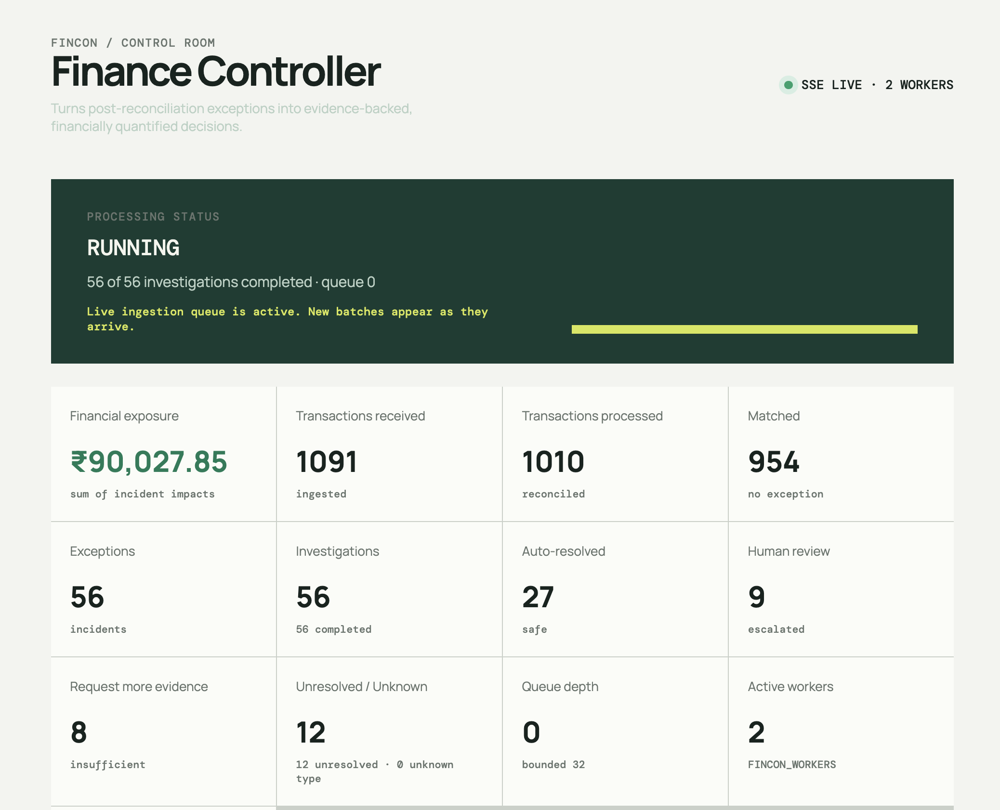
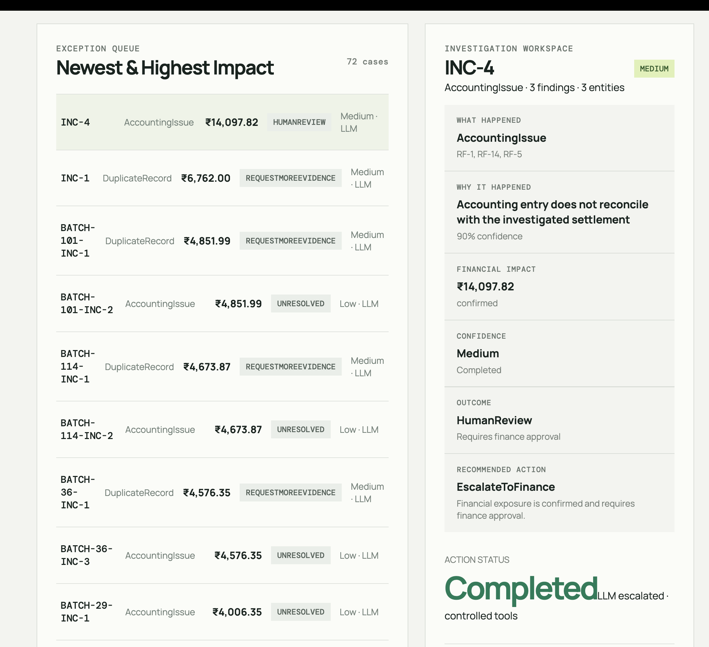

# FinCon

FinCon is an AI-powered Finance Controller that investigates financial exceptions that remain after reconciliation. It goes beyond identifying that a transaction does not match by determining the likely root cause, gathering supporting evidence, quantifying the financial impact, assessing confidence, and recommending the safest next action.

By combining deterministic financial controls with agentic investigation, FinCon helps finance teams reduce manual exception-handling effort, prioritize financially significant issues, and resolve cases faster while preserving human oversight, explainability, and auditability.

---

## Problem Statement

Modern financial systems process large volumes of payments, refunds, settlements, bank transactions, and accounting records. Reconciliation helps identify discrepancies, but finding a mismatch is only the beginning.

When an exception occurs, finance teams still need to investigate:
- **What went wrong**
- **Why it happened**
- **Which records are related**
- **How much money is affected**
- **What action should be taken**

This often requires manually searching across multiple systems and validating evidence.

The challenge is to build an intelligent Finance Controller that can **automate this investigation process**, provide evidence-backed conclusions and financial impact, while escalating uncertain or sensitive cases for human review instead of making unsafe decisions.

---

## Solution

FinCon acts as an intelligent investigation layer on top of financial reconciliation. Instead of stopping when reconciliation identifies an exception, FinCon automatically investigates the case across related financial records.

It combines **deterministic financial analysis with agentic investigation** to gather relevant evidence, identify the probable root cause, calculate the financial impact, assess confidence, and determine the appropriate outcome.

Every investigation produces a structured, auditable result:

$$\text{Exception} \longrightarrow \text{Evidence} \longrightarrow \text{Root Cause} \longrightarrow ₹\text{ Impact} \longrightarrow \text{Confidence} \longrightarrow \text{Decision} \longrightarrow \text{Recommendation} \longrightarrow \text{Audit Trail}$$

When the evidence is insufficient or the risk is too high, FinCon does not guess. It can request more evidence, escalate the case for human review, or mark it as unresolved.

___
Refer .env.example for env structure required
___

## Tech Stack

| Technology | Purpose |
|---|---|
| **C++20 + CMake** | Core financial processing, deterministic reconciliation engine, and backend |
| **Meta Llama** | Agentic AI-powered exception investigation and hypothesis reasoning |
| **Svelte + TypeScript** | Responsive command dashboard and interactive investigation UI |
| **Python** | High-fidelity synthetic data generation and exception scenario modeling |
| **REST + SSE** | Synchronous API endpoints and Server-Sent Events for real-time streaming updates |

---

## Key Features

- **Automated Reconciliation & Exception Detection:** High-speed deterministic rule matching.
- **Evidence-Based Financial Investigation:** Deep correlation across ledger, bank, and gateway records.
- **Root-Cause Analysis with AI:** Hypothesis generation and validation using LLM reasoning with tool constraints.
- **Financial Impact & Confidence Assessment:** Precise quantification of financial exposure before decisioning.
- **Human Review for Uncertain Cases:** Risk-weighted escalation boundaries prevent automated errors.
- **Complete Investigation Audit Trail:** Append-only logging of evidence, tool invocations, hypotheses, and decisions.
- **Finance Command Centre:** Live operational dashboard with real-time SSE stream processing metrics.

---

## How It Works

```text
Financial Data
      ↓
Deterministic Reconciliation
      ↓
Exception Detection
      ↓
Agentic Investigation
      ↓
Evidence Gathering & Root-Cause Hypotheses
      ↓
Financial Impact (₹) & Confidence Scoring
      ↓
Deterministic Decision & Risk Thresholding
      ↓
Actionable Recommendation
      ↓
Immutable Audit Trail
```

---

## FinCon Architecture

FinCon follows a deterministic-first architecture where financial truth is established through controlled processing and reconciliation, while AI is used selectively for investigating exceptions.

The system processes financial data from ingestion through reconciliation, investigation, decisioning, audit, and the Finance Command Centre.

### System Diagram


### Architecture Pipeline

```text
Ingestion
    ↓
Schema Inspection & Field Mapping
    ↓
Deterministic Validation
    ↓
Financial Data Store
    ↓
Bounded Processing Queue & Worker Pool
    ↓
Deterministic Reconciliation
    ↓
Findings & Correlation
    ↓
Business Incidents
    ↓
Investigation
    ↓
Evidence & Hypotheses
    ↓
Financial Impact
    ↓
Decision & Escalation
    ↓
Recommendation
    ↓
Audit Trail
    ↓
REST / SSE
    ↓
Finance Command Centre
```

### Component Details

1. **Ingestion:** Accepts heterogeneous financial JSON, maps supported schemas into canonical financial models, and rejects ambiguous or invalid mappings.
2. **Stream Processing:** Uses a bounded queue and worker pool to process financial batches with backpressure and idempotency controls.
3. **Reconciliation:** Applies deterministic reconciliation rules to identify financial discrepancies without relying on the LLM.
4. **Incident Correlation:** Groups related findings and financial entities into business-level incidents.
5. **Investigation:** Collects relevant evidence, generates hypotheses, calculates financial impact, and determines whether AI escalation is required.
6. **Decision & Recommendation:** Applies deterministic decision and escalation policies to determine whether a case can be automatically resolved, requires human review, needs more evidence, or remains unresolved.
7. **Audit:** Maintains an append-only investigation trail covering evidence, tools, hypotheses, decisions, recommendations, and completion.
8. **State & API:** Maintains thread-safe application state and exposes REST APIs and Server-Sent Events for live updates.
9. **Finance Command Centre:** Provides a live operational view of ingestion, processing, exceptions, investigations, financial exposure, decisions, and investigation activity.

---

## Validation & Accuracy

FinCon was tested against synthetic financial data with deliberately injected exception scenarios. The current prototype demonstrates the complete flow from reconciliation through investigation and decisioning.

| Metric / Evaluation Area | Prototype Benchmark Result | Notes & Description |
|---|:---:|---|
| **Exception Scenarios Evaluated** | `8` | Distinct injection profiles covering diverse payment lifecycle stages |
| **Reconciliation Findings Detected** | `16` | Raw discrepancy flags raised by the deterministic rules engine |
| **Correlated Business Incidents** | `8` | Multi-finding aggregates mapped to singular root incidents |
| **Finding → Incident Correlation Accuracy** | `100%` | Complete precision in clustering related transaction discrepancies |
| **Incident Classification Accuracy** | `~80%` | Correct categorization of underlying exception taxonomy |
| **Deterministic Reconciliation Coverage** | `~70%` | Pure rule-based coverage prior to agentic investigation trigger |
| **Investigation Layer Completion Rate** | `~65%` | Autonomous hypothesis and evidence closure without stall |
| **Zero-Impact Safe Cases Verified** | `2` | Correctly identified timing shifts with ₹0 balance exposure |
| **Deliberately Unresolvable Cases** | `1` | Validates safety gate refusing hallucinated resolutions |

*Note: These figures represent prototype evaluation benchmarks on synthetic test suites and do not reflect production SLA guarantees. The agentic investigation layer utilizes stochastic LLM reasoning and output may vary across executions.*

---

### Exception Scenario Coverage

| Scenario | Incident Type | Financial Impact | Confidence Level | Expected Outcome | System Action |
|---|---|---:|:---:|---|---|
| **Duplicate Settlement** | Duplicate Record | ₹34,843.21 | High | Human Review | Flagged for Finance Ops; hold batch release |
| **Missing Record** | Missing Record | ₹4,874.33 | Medium | Request More Evidence | Query upstream gateway batch logs |
| **Delayed Settlement** | Timing Issue | ₹0.00 | High | Auto Resolve | Mark as in-transit timing delay; auto-close |
| **Refund Mismatch** | Refund Issue | ₹10.00 | Medium | Request More Evidence | Request acquirer fee breakdown ledger |
| **Partial Settlement** | Settlement Issue | ₹18,670.21 | High | Human Review | Escalate split settlement balance discrepancy |
| **Bank Timing Shift** | Timing Issue | ₹0.00 | High | Auto Resolve | Match against next-day clearing cycle; auto-close |
| **Fee Discrepancy** | Fee Issue | ₹5.00 | Medium | Request More Evidence | Check contract rate card tier updates |
| **Unresolvable Settlement** | Settlement Issue | ₹0.01 | Low | Unresolved | Block automated signoff; route to triage queue |

*The evaluation intentionally includes both resolvable and uncertain cases to ensure FinCon strictly adheres to financial safety gates rather than forcing synthetic resolutions.*

---

## Scalability & Extensibility

The agentic framework is built around controlled tool calls and can be extended without redesigning core components:

- **Incremental Tool Growth:** New financial tool bindings (e.g., SWIFT verification, gateway ledger APIs) can be added as isolated functions.
- **RAG for Policies & SOPs:** As domain complexity grows, FinCon can incorporate Retrieval-Augmented Generation (RAG) over company finance manuals, internal accounting policies, standard operating procedures, and historical resolved cases.
- **Deterministic Guardrails:** Financial calculations, impact metrics, and threshold checks remain 100% deterministic and auditable, ensuring the LLM acts only as an investigative researcher.
- **Distributed Infrastructure:** The architecture is structured to scale cleanly from the prototype in-memory queue to distributed message buses (Kafka/RabbitMQ), persistent relational/document storage, and horizontally scaled worker clusters.

---

## Current Scope, Limitations & Future Roadmap

| Functional Area | Current Scope (Prototype) | Current Limitation | Future Production Roadmap |
|---|---|---|---|
| **Financial Processing** | Deterministic reconciliation, anomaly identification, and exception investigation | Relies on in-memory mock transactional state | Durable distributed data store (PostgreSQL / TimescaleDB) |
| **AI Investigation** | Meta Llama agent with restricted financial tool calling | Constrained tool vocabulary and stochastic output sensitivity | Custom fine-tuned models, expanded tool sets, and specialized sub-agents |
| **Evidence Gathering** | Structured canonical financial models and local transaction correlation | Scope restricted to synthetically generated datasets | Enterprise RAG over accounting SOPs, contracts, and historical ledgers |
| **Decisioning Engine** | Confidence-aware rule policies with automated human escalation | Hard-coded risk threshold matrices | Dynamic company policy engine with configurable approval matrices & RBAC |
| **Infrastructure & Queue** | Bounded in-memory queue with multi-threaded C++ worker pool | Single-host deployment instance | Distributed Kafka/RabbitMQ broker with horizontal auto-scaling worker nodes |
| **Integration & Action** | REST endpoints, SSE stream feeds, and structured JSON output | Read-only analysis without automated ledger mutating actions | Two-way core banking connectors, ERP integrations (SAP/Oracle), and webhooks |

# Run FinCon

## Docker

Build and start the application:

```bash
docker compose up --build -d
```

Application ports:

- Frontend: http://localhost:3000
- Backend: http://localhost:8080

Open the dashboard:

```text
http://localhost:3000
```

Check the backend:

```bash
curl http://localhost:8080/health
```

Stop the application:

```bash
docker compose down
```

## Run Normal Batch Data

Generate 5 batches:

```bash
docker compose --profile producer run --rm producer
```

The producer sends batches to:

```text
http://backend:8080
```

Typical output:

```text
202 {"accepted":true,"batchId":"BATCH-1","messageId":"MSG-BATCH-1","schemaStatus":"MAPPED","status":"QUEUED"}
202 {"accepted":true,"batchId":"BATCH-2","messageId":"MSG-BATCH-2","schemaStatus":"MAPPED","status":"QUEUED"}
202 {"accepted":true,"batchId":"BATCH-3","messageId":"MSG-BATCH-3","schemaStatus":"MAPPED","status":"QUEUED"}
```

## Run Live Stream

Start continuous data generation:

```bash
docker compose --profile producer run --rm producer python producer.py --continuous --delay 2 --server-url http://backend:8080
```

Live batches continuously enter the processing pipeline.

Typical output:

```text
202 {"accepted":true,"batchId":"BATCH-1","messageId":"MSG-BATCH-1","schemaStatus":"MAPPED","status":"QUEUED"}
202 {"accepted":true,"batchId":"BATCH-2","messageId":"MSG-BATCH-2","schemaStatus":"MAPPED","status":"QUEUED"}
202 {"accepted":true,"batchId":"BATCH-3","messageId":"MSG-BATCH-3","schemaStatus":"MAPPED","status":"QUEUED"}
...
```

Stop the live producer:

```text
Ctrl+C
```

## Watch Backend Live Logs

```bash
docker compose logs -f backend
```

## Watch SSE Events

```bash
curl -N http://localhost:8080/api/events
```

Live events include:

```text
batch_received
batch_queued
processing_started
reconciliation_completed
incident_created
investigation_started
tool_executed
evidence_collected
investigation_completed
processing_completed
```

## Main Ports

| Service | Port |
|---|---:|
| Frontend | `3000` |
| Backend API | `8080` |

## Quick Demo

Start FinCon:

```bash
docker compose up --build -d
```

Open:

```text
http://localhost:3000
```

Then start the live producer:

```bash
docker compose --profile producer run --rm producer python producer.py --continuous --delay 2 --server-url http://backend:8080
```

In another terminal:

```bash
docker compose logs -f backend
```

Or watch the SSE stream directly:

```bash
curl -N http://localhost:8080/api/events
```

Stop everything:

```bash
docker compose down
```

## Dashboard

The dashboard provides a live view of the complete FinCon financial investigation pipeline, including ingestion, processing, reconciliation, exceptions, investigations, financial impact, confidence, decisions, recommendations, audit activity, and live streaming transaction data.



## Exception Investigation

The exception view provides the exception list and detailed investigation information, including the identified issue, financial impact, evidence, investigation status, confidence, decision, recommendation, and related financial records.

